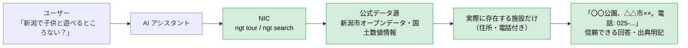

# NIC — Niigata Information Connector

## 導入: AI は、いま新潟の「インフラ」になる

**「チャッピーに聞いてみよう」——いま、そんな会話が当たり前になっています。**

ChatGPT（通称チャッピー）に気軽に質問する人が増え、旅行の計画も、お出かけ前の天気確認も、まず AI に聞く時代です。

もし、ここに**新潟に特化した AI** があればどうでしょう。
「新潟に何がある？」「今どこが楽しい？」——県外の若者がチャッピーに聞くだけで、新潟の魅力にたどり着ける。
**AI は新潟の経済に影響を与えられる存在になりつつあります**。

---

## 課題: いまの AI は、新潟の「今」に答えられない

新潟に特化した AI を作ろうとしても、現状の AI には 3 つの課題があります。

### 課題1: コストが高い

Web 検索で情報を得る場合、AI は検索結果の Web ページ全文を読み込むため、**トークンを大量に消費**します。
検索回数・トークンに比例してコストは膨らみ、**誰でも気軽に運用できる**値段ではありません。

### 課題2: 情報が正確ではない

- 検索結果は、GEO（Generative Engine Optimization）や AIO（AI Optimization）によって、
  **AI に拾われやすいよう最適化されたコンテンツに誘導**され、情報自体が歪みます。
- 検索インデックスには遅延があり、「今まさに」の警報・雨・積雪には届きません。
- システムプロンプトで「新潟だけに絞れ」と指定しても、**ツール（検索）が返す結果自体が歪んでいては**、
  新潟に特化した正確な AI にはなりません。

### 課題3: ガードレールがない

一般の AI に「新潟について教えて」と聞くと、**出典の曖昧な情報・古い情報・個人サイトの情報**まで
混ざって返ってきます。どこまでが確かな情報なのか、利用者には分かりません。

### 従来の AI のフロー（課題の全体像）


ユーザーの質問から回答まで、**コスト・正確性・ガードレール**のすべての段階で問題が発生します。

---

## 提案: NIC — 新潟に特化した AI を作るデータ基盤

**NIC（Niigata Information Connector）** は、新潟の公式データ源（気象庁・新潟県・新潟市・国土交通省）に、
最適化されたフローで直接アクセスし、必要な情報だけを、最小のトークンで、リアルタイムに AI へ届けるデータ基盤です。

```
あなたのAIアシスタント（Claude / ChatGPT / Cursor など）
        │  「新潟の積雪は？」「十日町に警報は？」「雨の日のおすすめは？」
        ▼
┌─────────────────────────────────────┐
│  NIC（この基盤）                     │
│  ・新潟県の気象・防災・観光・統計データ │
│  ・出典明記つき・常に最新・高速キャッシュ│
└─────────────────────────────────────┘
        │  公式データ源（気象庁・新潟県・新潟市・国土交通省）
        ▼
   新潟のリアルな今（実データ）
```

- **CLI（`ngt`）**: AI エージェントがシェルから新潟データを引くためのツール
- **MCP（`ngt-mcp`）**: 対応クライアントを増やすための標準インターフェース（Claude Desktop / Cursor 等）

新潟特化モデルの学習（高コスト・特定LLM依存）ではなく、**ツール提供（低コスト・全LLM対応）**で
「AI × 新潟」の課題を解決します。

---

## 解決: 3 つの課題が、すべて解決する

### NIC を使った AI のフロー（解決の全体像）



ユーザーの質問から回答まで、**コスト・正確性・ガードレール**のすべての段階で問題が解消されます。

| 課題 | Web 検索 | NIC |
|---|---|---|
| コスト | ページ全文を読み**大量トークン消費** | 必要な値だけを**最小トークン**で返す |
| 正確性 | GEO/AIO で**結果が歪む**・インデックス遅延 | **公式データそのもの（一次情報）**・毎分更新 |
| ガードレール | 出典の曖昧な情報が混ざる | **公式データ源のみ**・出典を必ず明記 |
| 特化 | 他県の情報も混ざる | **新潟の公式データ源のみ** |
| リアルタイム性 | 検索インデックスは遅延あり | アメダス 10 分更新・警報 毎分更新 |

そして——なんなら、こういうメリットまであります。

- **新潟特化 AI を誰でも・低コストで提供できる**（モデル学習不要・ツール提供なので）
- **AI エージェントの道具として使える**（CLI はトークン効率が良く、決まったソースから決まった構造で値を受け取れる）
- **出典が常に付く**（公式データ源なので、どこから来た情報かが明確）

---

## 新潟を、AI で盛り上げよう

新潟特化 AI を誰でも提供できるようになれば、**チャッピーを通じて新潟の良さが若者に再発見され、
新潟の活性化につながります**。
観光も、防災も、情報発信も——新潟の「今」を AI につなぐ。
それが NIC の目指す、『AI × 新潟』の未来です。

---

## 誰でも簡単に、AI に新潟を教えられる

### 30 秒でできる（Claude Desktop の例）

```bash
# 1) インストール（Python 3.13 と uv が必要）
uv sync
```

```jsonc
// 2) claude_desktop_config.json にこれを追加するだけ
{
  "mcpServers": {
    "nic": {
      "command": "uv",
      "args": ["--directory", "C:/path/to/nic", "run", "ngt-mcp"]
    }
  }
}
```

```text
// 3) あとは AI に聞くだけ
あなた: 新潟県で今、大雨の警報や注意報が出ている場所は？
Claude: 糸魚川市・妙高市・上越市・津南町に大雨注意報、十日町市・魚沼市・南魚沼市・湯沢町に雷注意報が発表中です（新潟地方気象台、本日 5:02 発表）。
```

コードを書く必要はありません。**設定ファイル 1 個で、あなたの AI が新潟の専門家になります。**

### AI が答えられるようになること

| 質問の例 | AI が参照するデータ |
|---|---|
| 「新潟県で積雪が一番深い場所は？」 | 気象庁アメダス（44 観測所・積雪） |
| 「長岡の天気は？」 | 気象庁アメダス（気温・降水量） |
| 「今、警報が出ている市町村は？」 | 気象庁防災情報XML（警報・注意報 4 階層） |
| 「雨の日でも楽しめるおすすめは？」 | 気象庁アメダス × 観光スポット |
| 「新潟市の人口は？」 | 新潟県オープンデータ |
| 「湯沢周辺の観光情報は？」 | 新潟市オープンデータ / 国土数値情報（県内全域の集客施設） |

すべての回答に**出典（気象庁・新潟県・新潟市・国土交通省）が含まれ**、誤った情報・古い情報を
AI がそのまま話すリスクを減らします。

---

## 仕組み

### コア: 新潟データへの統一アクセス層

1 つのコア（`nic.core`）が、公式データ源からデータを取得・整形・キャッシュし、
**常に出典つき・統一フォーマット**で返します。このコアにインターフェースを足すだけで、
どんなクライアントからでも新潟データを扱えます。

```
nic.core（データ取得層）
  ├── amedas    気象庁アメダス（積雪・気温・降水量）
  ├── warning   気象庁防災情報XML（警報・注意報）
  ├── opendata  新潟県オープンデータ（統計・道の駅）
  └── tourism   観光スポット・入込客数（新潟市/国土数値情報）
        │
        ├── CLI インターフェース（エージェントの道具として: ngt）
        └── MCP インターフェース（対応クライアントを増やす手段: ngt-mcp）
```

### CLI: AI エージェントの「道具」

AI エージェントは、シェルでコマンドを実行できます。`ngt` はそのための道具です。

```bash
ngt weather --station 長岡   # 「長岡の天気は？」に答えるため
ngt warning --level 市町村   # 「警報出てる？」に答えるため
ngt tour --weather --recommend  # 「雨の日のおすすめは？」に答えるため
ngt stats --population --municipality 新潟市  # 「人口は？」に答えるため
ngt search 湯沢              # 何かあれば横断検索
```

- 出力は**プレーンな表形式**（AI がパースしやすく、装飾なし）
- `--json` で機械可読出力（AI 向け）
- エラー時は「なぜ失敗したか」をヒント付きで返す（例: 積雪データは冬季のみ提供）

### MCP: 対応クライアントを増やす「標準インターフェース」

MCP（Model Context Protocol）は、AI クライアントに外部データを渡すための標準プロトコルです。
NIC は MCP サーバー（`ngt-mcp`）として動作するため、**MCP に対応しているクライアントなら
どれでも**（Claude Desktop / Cursor / その他）新潟データに接続できます。

提供ツール（7 つ）:

| ツール | 内容 |
|---|---|
| `get_snow_info` | 積雪情報（全 44 観測所 or 指定） |
| `get_weather_info` | 最高・最低気温・1 時間降水量 |
| `get_warning_info` | 警報・注意報（府県〜市町村 4 階層） |
| `get_tourist_spots` | 観光スポット一覧（温泉・集客施設） |
| `get_tour_recommendation` | 天気×おすすめ観光 |
| `get_niigata_stats` | 統計・オープンデータ（人口・道の駅・データセット） |
| `search_niigata_data` | 全データ横断検索 |

接続設定は README の「セットアップ」を参照（Claude Desktop / Cursor の例あり）。

---

## データカバレッジ（正直な制約）

| データ | カバー範囲 | 更新 |
|---|---|---|
| 気象（アメダス） | **新潟県全域** 44 観測所 | 10 分〜1 時間 |
| 警報・注意報 | **新潟県全域**（府県〜市町村） | 毎分 |
| 統計（人口・道の駅） | 新潟県全域 | 年次 |
| 観光スポット | **新潟県全域**（温泉 23 件=新潟市 + 集客施設 359 件=県内全域） | 年次〜不定期 |

- **温泉スポットは新潟市オープンデータのため新潟市内のみ**（西蒲区・秋葉区・南区など 23 件）。
  湯沢・十日町・妙高等の県内温泉地の温泉データは含まれません。
- **集客施設（映画館・公会堂・劇場など）は国土数値情報 P33 で県内全域をカバー**（長岡市 85・上越市 22・湯沢町 2 など）。
  ただし 2014 年度版のため、現存しない施設が含まれる・新設施設が未収録の場合があります。
- 詳細なデータ源・ライセンスは「データ源とライセンス」を参照。

---

## インストール

```bash
# Python 3.13 以上が必要
cd app-tech/nic
uv sync
```

これで `ngt`（CLI）と `ngt-mcp`（MCP サーバー）が使えます。

## セットアップ

### Claude Desktop

`claude_desktop_config.json` に追加:

```json
{
  "mcpServers": {
    "nic": {
      "command": "uv",
      "args": ["--directory", "C:/path/to/nic", "run", "ngt-mcp"]
    }
  }
}
```

### Cursor

`~/.cursor/mcp.json` または Settings → MCP に同じ設定を追加。

---

## 開発者向け

### コア API

各コアは `with` 文で使えるクライアントを提供します。すべて TTL キャッシュ・出典明記・
エラーハンドリング付きです。

```python
from nic.core.amedas import AmedasClient

with AmedasClient() as client:
    data = client.fetch_temperature(codes=["54232", "54841"])
    for obs in data.observations:
        print(obs.station.name, obs.value)  # 出典:気象庁
```

- `amedas`: 気象庁アメダス（`AmedasClient`）
- `warning`: 気象庁防災情報XML（`WarningClient`）
- `opendata`: 新潟県オープンデータ（`OpenDataClient`）
- `tourism`: 観光スポット・入込客数（`TourismClient`）

### テスト

```bash
uv run pytest    # 235 件
```

### CLI リファレンス（簡易）

```
ngt [--json] [--force] COMMAND
  snow      積雪情報（気象庁アメダス）
  weather   気温・降水量（気象庁アメダス）
  warning   警報・注意報（気象庁防災情報XML）
  tour      観光（スポット・温泉・入込客数・天気×おすすめ）
  stats     統計・オープンデータ（人口・道の駅・データセット）
  search    全データ横断検索
```

各コマンドの詳細は `ngt <command> --help` で確認できます。

---

## データ源とライセンス

| データ源 | 内容 | ライセンス / 利用条件 |
|---|---|---|
| 気象庁「最新の気象データ」CSV | アメダス（積雪・気温・降水量） | 気象庁ウェブサイト利用規約（出典表示必須） |
| 気象庁防災情報XML配信 | 警報・注意報電文（VPWW53/VPWW54） | 公共データ利用規約 第1.0版（出典表示・加工の明示・1日10GB以上のDL禁止） |
| 新潟県オープンデータ | データセット一覧・人口・道の駅 | 新潟県オープンデータ利用規約（出典表示） |
| 新潟市オープンデータ | 観光入込客数・温泉GIS・観光データセット | クリエイティブ・コモンズ 表示（CC-BY） |
| 国土数値情報（国土交通省） | 集客施設 P33（2014年度版） | 国土数値情報利用約款（出典明記で無償利用・加工・再配布可） |

- 本ツール（NIC）自体は **MIT License** で公開しています（[LICENSE](LICENSE) 参照）。
- 取得・表示する**データの権利は各データ源に帰属**し、各利用条件に従う必要があります。
- 本ツールの出力（CLI / MCP）には必ず出典が含まれており、各データ源の利用条件（出典表示）を
  満たすことを意図しています。

---

## 開発メモ

- 新潟県 CKAN API（`ckan.pref.niigata.lg.jp`）は 2026-08 現在 DNS 解決不可のため、
  公式サイトの CSV へ自動フォールバックする（実行時「注:」で通知）。
- 積雪データは夏季（概ね 5〜9 月）提供休止のため、`snow` は 404 エラー + ヒントを返す。
